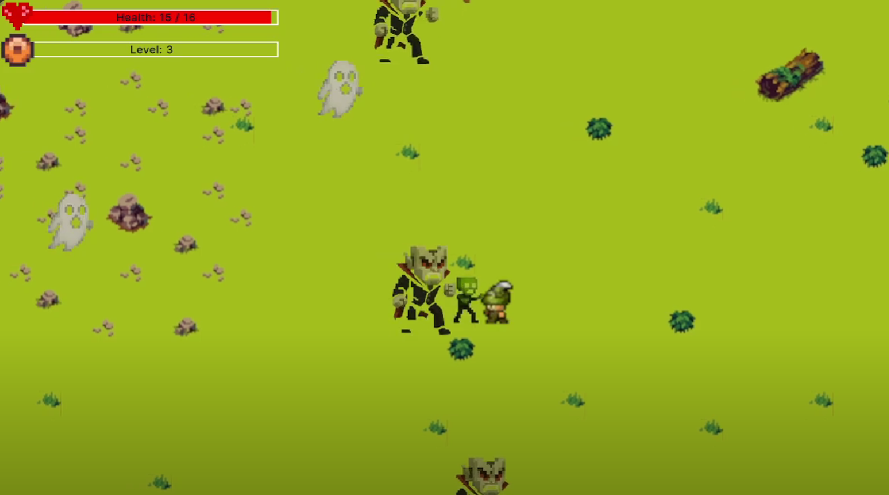
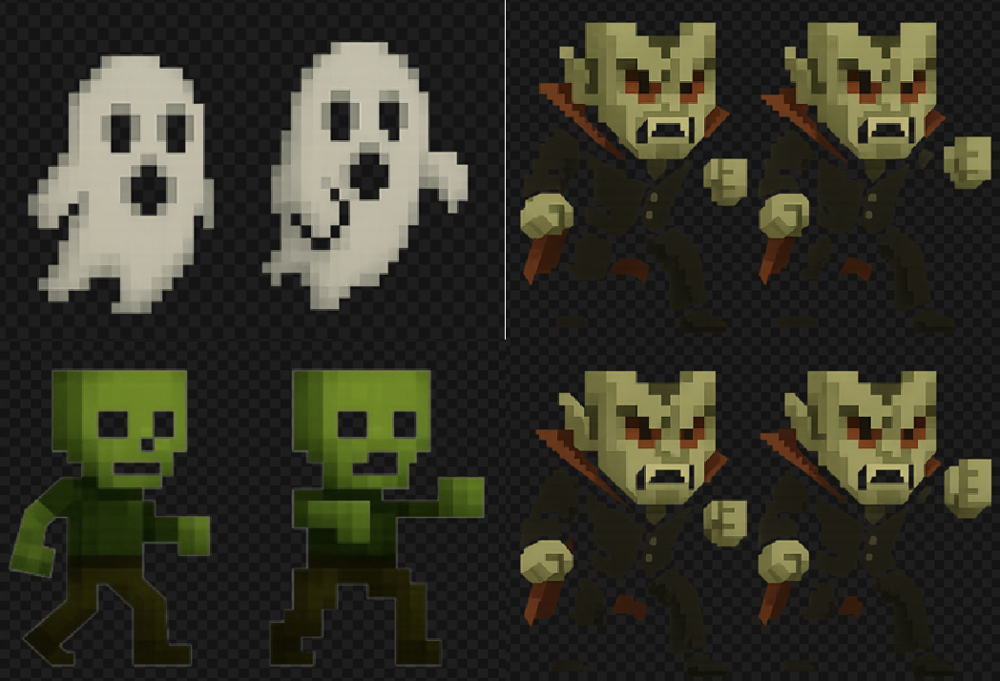

# UltimateGMDProject Development Blog 4

Adrian Bugiel

06-06-2025

## Final project showcase

After weeks of dedicated development, our Vampire Survivors-inspired game, VIA Survivors, is now fully playable and deployed to the VIA arcade machine. Built in Unity, the project features a mix of arcade-style action and roguelike progression.

## Core features

We implemented several key features to deliver an engaging game loop:

- **Experience & Progression**  
  Player earns experience by defeating enemies. Upon leveling up, they are presented with two randomized upgrade options. Available upgrades include:
  - Health (+ 10 hp/level)
  - Damage (+ 0.5 dmg/level)
  - Movement Speed (+ 0.5 unit/level)
  - Fire Rate (- 0.05 s/level)
  - Projectile Count  (+ 1 arrow/level)
  Each upgrade supports up to 10 levels, providing meaningful long-term progression and some degree of randomization.

- **PowerUpManager System**  
  Coordinates upgrade logic across gameplay components such as `HealthComponent`, `DamageDealer`, `PlayerController`, and `ProjectileShooter`. This system listens to level-up events from the `ExperienceManager` and enables stat scaling.

- **Dynamic Enemy Spawning**  
  An `EnemySpawner` manages three different enemy types (slow and weak zombies, fast moving ghosts, resilient and heavy-hitting vampires) with independent spawn limits. These limits increase over time to maintain pressure on the player. Spawning is dynamically adjusted based on proximity to the player’s movement.

- **Sound Management**  
  A centralized `SoundManager` handles both background music and sound effects, including:
  - Level-up sound indication
  - Hit reactions (for both player and enemies)
  - Ambient audio  
  The system uses two dedicated `AudioSource` components to separate SFX from music channels.

- **User Interface**  
  Built using **Unity UI Toolkit**, the UI includes:
  - Health and experience bars
  - A “Choose Upgrade” screen during level-ups
  - Pause and death menus  
  This UI is connected directly with core game logic and reacts to player status in real time.

- **Graphics & Animation**  
  All enemy sprites were generated using **Sora AI**, and basic sprite animations (3–4 frames per enemy) were integrated using Unity’s Animator system. The game features a handcrafted tilemap for the world layout and imported character graphics, all designed to support a consistent pixel-art aesthetic.

## Summary

The development of *VIA Survivors* provided us hands-on experience with scripting, system design, audio, UI, and progression balancing under time constraints. Despite challenges, the result is a polished and replayable arcade game with substantial level of difficulty.

## Gameplay

## Art showcase

